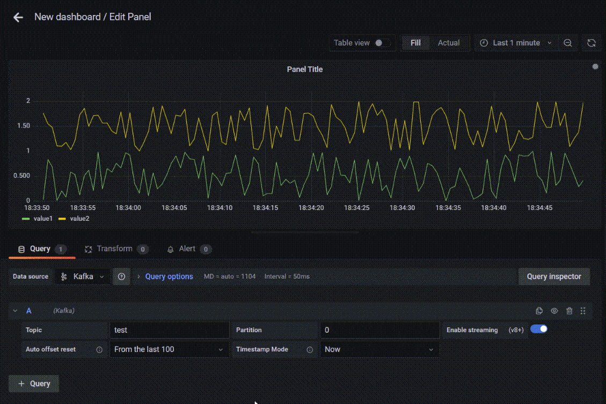

# Kafka Datasource for Grafana

The Kafka data source plugin allows you to visualize streaming Kafka data from within Grafana.

## Reqirements

- Apache Kafka v0.9+
- Grafana v8.0+

> Note: This is a backend plugin, so the Grafana server should've access to the Kafka broker.

## Known limitations

- The plugin currently does not support any authorization and authentication method.
- The plugin currently does not support TLS.
- Timestamps are determined concerning the current time of consuming messages by the plugin.

This plugin automatically supports topics publishing very simple JSON formatted messages. Note that only the following structure is supported as of now:

```json
{
    "value1": 1.0,
    "value2": 2,
    "value3": 3.33,
    ...
}
```

We plan to support more complex JSON data structures and Protobuf and AVRO in the upcoming releases. Contributions are highly encouraged!

## Getting started

1. Download and place the data source release in grafana/plugins directory. This plugin is not signed yet, so Grafana will not allow loading it by default. You should enable it by adding `GF_PLUGINS_ALLOW_LOADING_UNSIGNED_PLUGINS` environment variable. For example, if you are using Grafana with containers, add:

   ```yaml
   -e "GF_PLUGINS_ALLOW_LOADING_UNSIGNED_PLUGINS=hamedkarbasi93-kafka-datasource"
   ```

2. In Grafana from the left-hand menu, navigate to **Configuration** > **Data sources**.
3. From the top-right corner, click the **Add data source** button.
4. Search for `Kafka` in the search field, and hover over the Kafka search result.
5. Click the **Select** button for Kafka.

## Configure the data source

[Add a data source](https://grafana.com/docs/grafana/latest/datasources/add-a-data-source/) by filling in the following fields:

### Basic fields

| Field | Description                                        |
| ----- | -------------------------------------------------- |
| Name  | A name for this particular AppDynamics data source |
| Servers  | The URL of the Kafka bootstrap servers separated by comma. E.g. `broker1:9092, broker2:9092`              |

### Query the Data source

To query the Kafka topic, you have to config the below items in the query editor.

| Field | Description                                        |
| ----- | -------------------------------------------------- |
| Topic  | Topic Name |
| Partition  | Partition Number |

> **Note**: Make sure to enable the `streaming` toggle.



## Compiling the data source by yourself

A data source backend plugin consists of both frontend and backend components.

### Frontend

1. Install dependencies

   ```bash
   yarn install
   ```

2. Build plugin in development mode or run in watch mode

   ```bash
   yarn dev
   ```

   or

   ```bash
   yarn watch
   ```

3. Build plugin in production mode

   ```bash
   yarn build
   ```

### Backend

1. Update [Grafana plugin SDK for Go](https://grafana.com/docs/grafana/latest/developers/plugins/backend/grafana-plugin-sdk-for-go/) dependency to the latest minor version:

   ```bash
   go get -u github.com/grafana/grafana-plugin-sdk-go
   go mod tidy
   ```

2. Build backend plugin binaries for Linux:

   ```bash
   go build -o dist/gpx_kafka-datasource_linux_amd64 ./pkg
   ```

## Contributing

Thank you for considering contributing! If you find an issue or have a better way to do something, feel free to open an issue or a PR.

## License

This repository is open-sourced software licensed under the [Apache License 2.0](https://www.apache.org/licenses/LICENSE-2.0).

## Learn more

- [Build a data source backend plugin tutorial](https://grafana.com/tutorials/build-a-data-source-backend-plugin)

- [Grafana plugin SDK for Go](https://grafana.com/docs/grafana/latest/developers/plugins/backend/grafana-plugin-sdk-for-go/)
